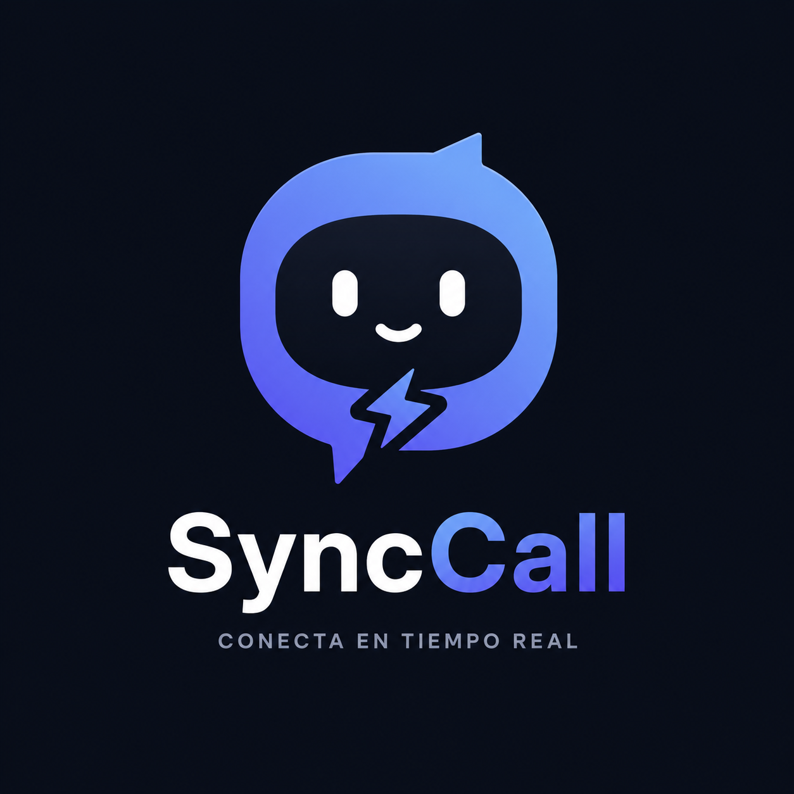

# SyncCall

<p align="center">
  
</p>

Aplicación de mensajería en tiempo real tipo Discord, desarrollada como proyecto de portafolio. Permite autenticarte, personalizar tu perfil, agregar amigos y chatear con ellos en tiempo real, viendo quién está online al instante.

> Estado actual: en definición / diseño. Todavía no hay código ni base de datos implementada.

## ¿De qué se trata?

SyncCall busca replicar la experiencia central de una app de comunicación social moderna (como Discord), enfocándose primero en la relación 1 a 1 entre usuarios: agregar amigos, ver su estado en tiempo real y mandarse mensajes directos (DM) sin recargar la página.

El proyecto está pensado como pieza de portafolio, así que además de funcionar, busca demostrar manejo de:

- Autenticación real con proveedores externos (OAuth)
- Comunicación en tiempo real (WebSockets vía Socket.IO)
- Modelado de datos en una base NoSQL (MongoDB)
- Una arquitectura full-stack en TypeScript de punta a punta

## Funcionalidades del MVP

- **Autenticación** con Google y GitHub (OAuth), sesión vía JWT.
- **Perfil personalizable**: nombre de usuario, nombre visible, biografía, avatar (subida de imagen), color de acento y estado (online / ausente / no molestar / invisible).
- **Búsqueda de usuarios** por nombre de usuario.
- **Solicitudes de amistad**: enviar, aceptar, rechazar.
- **Lista de amigos** con estado online/offline actualizado en tiempo real.
- **Mensajes directos (DM)** en tiempo real, con historial persistente e indicador de "escribiendo...".

## Fuera de alcance por ahora (Fase 2)

- Servidores / comunidades con múltiples miembros.
- Canales de texto grupales dentro de un servidor.
- Canales de voz / videollamadas.
- Roles y permisos.
- Reacciones, edición y borrado de mensajes, notificaciones push.

## Identidad visual

Paleta de colores usada en el diseño de la UI (tema oscuro).

### Paleta principal

| Uso | Hex |
|---|---|
| Primario | `#5B6DFF` |
| Primario Hover | `#4C5CF5` |
| Primario Claro | `#7F8DFF` |
| Secundario Violeta | `#7A5AF8` |
| Gradiente | `#5B6DFF` → `#7A5AF8` |

### Fondo

| Uso | Hex |
|---|---|
| Fondo Principal | `#0F172A` |
| Fondo Secundario | `#161B2E` |
| Cards | `#1C2238` |
| Sidebar | `#131827` |
| Navbar | `#111827` |

### Superficies

| Uso | Hex |
|---|---|
| Hover | `#252D47` |
| Card Hover | `#2D3654` |
| Border | `#303B5A` |

### Texto

| Uso | Hex |
|---|---|
| Principal | `#FFFFFF` |
| Secundario | `#C7D2FE` |
| Descripción | `#94A3B8` |
| Deshabilitado | `#64748B` |

### Estados

| Estado | Hex |
|---|---|
| Online | `#22C55E` |
| Ausente | `#F59E0B` |
| No molestar | `#EF4444` |
| Invisible | `#6B7280` |

### Mensajes

| Uso | Hex |
|---|---|
| Burbuja propia | `#5B6DFF` |
| Burbuja recibida | `#252D47` |
| Hora | `#94A3B8` |

### Botones

| Variante | Fondo | Hover | Active | Texto |
|---|---|---|---|---|
| Primario | `#5B6DFF` | `#4C5CF5` | `#4250DA` | `#FFFFFF` |
| Secundario | `#252D47` | `#303B5A` | — | `#FFFFFF` |
| Danger | `#EF4444` | `#DC2626` | — | `#FFFFFF` |

## Stack tecnológico

| Capa | Tecnología |
|---|---|
| Frontend | React + TypeScript + Vite + Tailwind CSS |
| Backend | Node.js + Express + TypeScript |
| Tiempo real | Socket.IO |
| Base de datos | MongoDB + Mongoose |
| Autenticación | Passport.js (OAuth Google/GitHub) + JWT |
| Imágenes de perfil | Cloudinary |

## Arquitectura (alto nivel)

Monorepo con dos paquetes principales:

```
SyncCall/
  client/    → Aplicación React (interfaz de usuario)
  server/    → API REST + servidor de sockets (Node/Express)
```

- El **cliente** se comunica con el servidor por HTTP (REST) para operaciones puntuales (login, búsqueda, historial de mensajes, edición de perfil) y mantiene una conexión persistente por **WebSocket** para todo lo que ocurre en tiempo real (mensajes nuevos, cambios de estado online/offline, indicador de "escribiendo...").
- El **servidor** valida la sesión del usuario (JWT) tanto en las rutas HTTP como en la conexión de socket, y persiste todo en MongoDB.

Por ahora el proyecto corre 100% en local (sin deploy).

## Modelo de datos (colecciones de MongoDB)

Diseño de las 5 colecciones necesarias para el MVP. Todavía es solo documentación: no hay conexión a base de datos ni código implementado.

### `users`

Un documento por persona registrada (vía Google o GitHub).

| Campo | Tipo | Descripción |
|---|---|---|
| `_id` | ObjectId | Identificador interno |
| `googleId` | string (opcional) | Id de Google, si se registró con ese proveedor |
| `githubId` | string (opcional) | Id de GitHub, si se registró con ese proveedor |
| `username` | string, único | Nombre de usuario, usado para buscar/agregar amigos |
| `displayName` | string | Nombre visible en la UI |
| `avatarUrl` | string | URL de la imagen de perfil (Cloudinary o avatar del proveedor OAuth por defecto) |
| `bannerUrl` | string (opcional) | URL de la imagen de banner del perfil (Cloudinary) |
| `bio` | string (opcional) | Biografía corta |
| `accentColor` | string | Color de acento elegido para personalizar su perfil |
| `status` | enum: `online` / `idle` / `dnd` / `invisible` | Estado que el usuario elige manualmente |
| `isOnline` | boolean | Calculado según conexiones de socket activas (no lo edita el usuario) |
| `createdAt` | Date | Fecha de alta |

**Índices**: único en `username`; único (disperso) en `googleId` y en `githubId`.

### `friendrequests`

Solicitudes de amistad entre dos usuarios, con su estado.

| Campo | Tipo | Descripción |
|---|---|---|
| `_id` | ObjectId | Identificador interno |
| `from` | ObjectId → `users` | Quién envía la solicitud |
| `to` | ObjectId → `users` | Quién la recibe |
| `status` | enum: `pending` / `accepted` / `declined` | Estado actual de la solicitud |
| `createdAt` | Date | Fecha de envío |

**Índices**: único compuesto en (`from`, `to`) para evitar solicitudes duplicadas.

### `friendships`

Relación de amistad ya confirmada entre dos usuarios (se crea al aceptar una `friendrequest`).

| Campo | Tipo | Descripción |
|---|---|---|
| `_id` | ObjectId | Identificador interno |
| `userA` | ObjectId → `users` | Un extremo de la amistad |
| `userB` | ObjectId → `users` | El otro extremo |
| `createdAt` | Date | Fecha en que se confirmó la amistad |

**Convención**: `userA` siempre es el ObjectId "menor" de los dos, para que el par nunca se guarde duplicado en distinto orden. **Índices**: único compuesto en (`userA`, `userB`).

### `conversations`

Una conversación 1 a 1 entre dos amigos (contenedor de mensajes).

| Campo | Tipo | Descripción |
|---|---|---|
| `_id` | ObjectId | Identificador interno |
| `participants` | [ObjectId, ObjectId] → `users` | Los dos usuarios de la conversación |
| `lastMessageAt` | Date | Fecha del último mensaje (para ordenar la lista de chats) |
| `createdAt` | Date | Fecha de creación de la conversación |

**Índices**: único compuesto en `participants` para que no se dupliquen conversaciones entre el mismo par de usuarios.

### `messages`

Cada mensaje individual dentro de una conversación.

| Campo | Tipo | Descripción |
|---|---|---|
| `_id` | ObjectId | Identificador interno |
| `conversation` | ObjectId → `conversations` | A qué conversación pertenece |
| `sender` | ObjectId → `users` | Quién lo envió |
| `content` | string | Texto del mensaje |
| `createdAt` | Date | Fecha de envío |
| `readAt` | Date (opcional) | Fecha en que el destinatario lo vio |

**Índices**: compuesto en (`conversation`, `createdAt`) para traer el historial paginado en orden.

### Relaciones entre colecciones

```
users ──< friendrequests >── users
users ──< friendships >── users
users ──< conversations >── users
conversations ──< messages
users ──< messages   (como sender)
```

## Seguridad y validaciones

Requisitos no negociables de seguridad para el MVP. Todavía es documentación: se implementan cuando se construya el backend, pero quedan definidos acá para no dejarlos librados al código.

### Gestión de credenciales

- **Ninguna credencial hardcodeada en el código**: Mongo URI, JWT secret, credenciales OAuth (Google/GitHub) y claves de Cloudinary viven únicamente en variables de entorno (`server/.env`, nunca commiteado).
- Se versiona un `.env.example` con las claves necesarias pero sin valores reales, como guía de setup.
- `.env` (y cualquier archivo con secretos) va en `.gitignore` desde el primer commit.
- El JWT se firma con un secreto largo y aleatorio (no un valor por defecto ni de ejemplo).

### Rate limiting

Todas las rutas HTTP y los eventos de socket que pueden ser abusados tienen límite de frecuencia (por IP y/o por usuario autenticado, según corresponda). Límites orientativos:

| Zona | Límite propuesto | Motivo |
|---|---|---|
| `/auth/*` (login OAuth) | 10 intentos / 15 min por IP | Evitar abuso del flujo de login |
| API general (`/api/*`) | 600 req / 15 min por usuario | Piso base contra scraping/abuso, no un throttle del uso normal (el chat por sí solo ya genera bastante tráfico legítimo de lectura) |
| `POST /api/users/search` | 30 req / min por usuario | Evitar enumeración masiva de usuarios |
| `POST /api/friend-requests` | 20 req / hora por usuario | Evitar spam de solicitudes de amistad |
| `POST /api/me/avatar` | 10 req / hora por usuario | Subidas de imagen son costosas (Cloudinary) |
| `POST /api/conversations/:id/media` | 30 req / hora por usuario | Subidas de imagen en el chat son costosas (Cloudinary) |
| Evento de socket `dm:send` | ~1 mensaje / 300ms por usuario (burst corto permitido) | Evitar flood de mensajes en tiempo real |

Al superar el límite, la API responde `429 Too Many Requests` (o el socket ignora/desconecta con warning), nunca falla en silencio ni cuelga el servidor.

### Validación y sanitización de inputs

- Todo input del cliente (body, query params, payloads de socket) se valida contra un esquema antes de tocar la base de datos (tipo, formato y longitud esperados).
- `username`: solo alfanumérico + `_`/`.`, largo entre 3 y 20 caracteres, único.
- `bio`: máximo ~190 caracteres.
- `content` de un mensaje: no vacío, largo máximo (ej. 2000 caracteres).
- Avatar: solo `image/png`, `image/jpeg`, `image/webp`; tamaño máximo (ej. 5 MB).
- El contenido de los mensajes se sanea/escapa antes de guardarse y antes de renderizarse en el cliente, para prevenir **XSS**.
- Todas las consultas a MongoDB usan Mongoose con esquemas tipados (no se arma ninguna query concatenando strings del usuario), para prevenir **inyección NoSQL**.

### Sesión y autenticación

- Sin passwords propias: login solo vía OAuth (Google/GitHub), reduce superficie de ataque de credenciales.
- JWT viaja en cookie `httpOnly` + `secure` (en producción) + `sameSite=lax`, nunca en `localStorage` (mitiga robo de token vía XSS).
- Expiración corta del JWT con renovación silenciosa, en vez de un token de vida eterna.
- Toda ruta de la API (salvo `/auth/*`) exige un JWT válido; toda conexión de socket se autentica en el handshake antes de unirse a cualquier room.
- Un usuario solo puede leer/escribir recursos de los que participa (ej. no puede pedir el historial de una conversación en la que no es participante) — se valida siempre contra `req.user`, nunca se confía en IDs que mande el cliente sin chequear pertenencia.

### Protecciones HTTP generales

- **CORS** restringido explícitamente al origen del frontend (`http://localhost:5173` en dev), no `*`.
- **Helmet** (o headers equivalentes) para cabeceras de seguridad HTTP estándar (`X-Content-Type-Options`, `X-Frame-Options`, CSP básica, etc.).
- Mitigación de **CSRF**: al usar cookies para el JWT, las rutas mutantes (`POST`/`PATCH`/`DELETE`) validan `sameSite` + origen, o exigen un header custom que un `<form>` externo no puede setear.
- Los mensajes de error hacia el cliente son genéricos (nunca se exponen stack traces, queries ni detalles internos); el detalle completo solo va a logs del servidor.
- Los logs del servidor nunca incluyen tokens, secretos ni contraseñas.

### Otras buenas prácticas

- Auditoría periódica de dependencias (`npm audit`) para detectar vulnerabilidades conocidas en paquetes.
- Conexión a MongoDB con un usuario de base de datos con permisos mínimos necesarios (no el usuario admin del cluster).
- Pensado para HTTPS obligatorio el día que haya deploy (cookies `secure` solo funcionan sobre HTTPS).

## Roadmap

1. ~~Definir nombre y alcance del proyecto~~
2. ~~Diseñar el modelo de datos (colecciones de MongoDB)~~
3. ~~Definir requisitos de seguridad y validaciones~~
4. Construir el backend (auth, API REST, sockets)
5. Construir el frontend (UI de amigos, chat, perfil)
6. Pulir experiencia y documentar setup completo
7. (Opcional, a futuro) Evaluar deploy y Fase 2 (servidores/comunidades)
